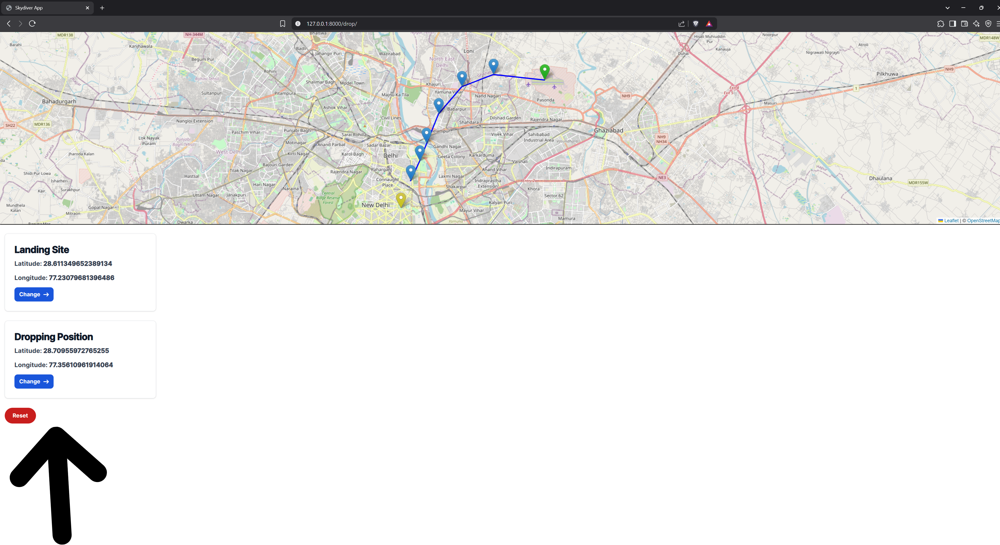
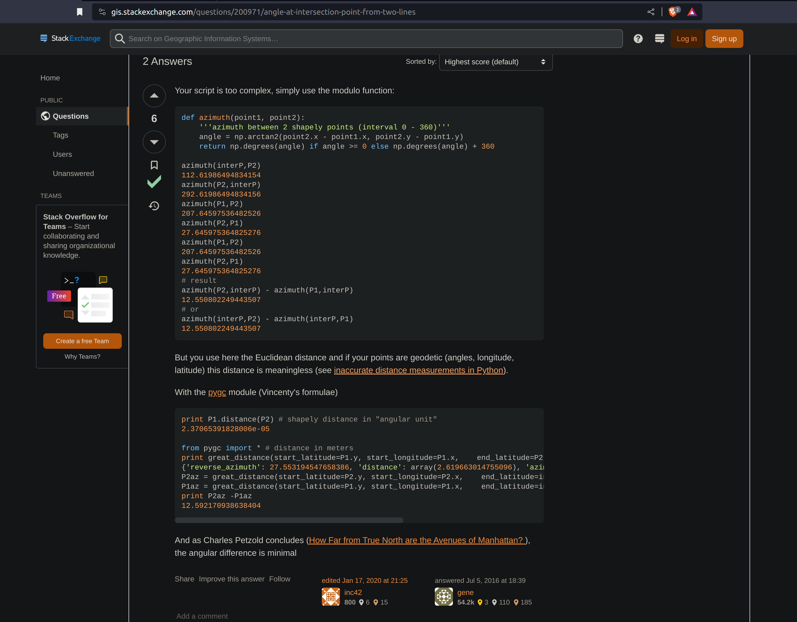

# SkyDive App

## The Motivations behind This Project

This was actually a random pitch during a discussion with one of my classmates. This app would project the direction (like a compass it points an arrow) using the gps of the skydiver and calculating the motion vector of the flight. Thus instead of seeing the map the skydiver can just pick the location (before the drop) where he wants to land, the phone can just display the arrow the direction he needs to point the lateral direction as well as the vertical arrow which show how much he needs to point down during flight.

Also there was future ideas to implement i.e. to use some sophisticated to calculate the best way/path to follow to land at the point instead of flying directly towards the landing point. This would be useful in case of low visibility or in rough terrain such as the mountain regions.

Frameworks such as Django, HTML/CSS/JavaScript, Folium, etc. 

See some screenshots [here...](#screenshots)

Also you can refer to the pre-devlopment phase plan [here...](Skydive%20App.pdf)


## Why I archived This Project

I actually completed this project to a certain extent before archiving this project. One of the main reason was that I couldn’t find any actual use cases. There were no people I know or had contact before that could require such an app

## Run Locally
Use these followin steps to run this `locally`

- Open ```terminal``` or ```cmd```
- Run 
    ```
    git clone https://github.com/Chronos-Asteri/skydive_app
    ```

- Move in the `project_skydive` folder then

- Create a python ```env``` and **run** ```python --version``` to check if it is running __Python3__
- Run
  ```
  pip install -r requirements.txt
  ```
- In order to launch the `web-app` run
  
  ```
  python manage.py runserver
  ```
- Open `http://localhost:8000/`

- ℹ️ Also the check the `urls` show in the terminal / cmd

## Screenshots

| | |
|:-------------------------:|:-------------------------:|
| |   |  
| |  | 
| ||